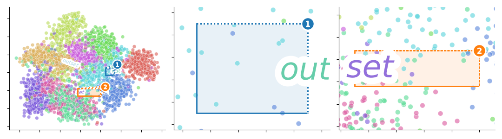

|PyPi| |CI| |Deploy Sphinx documentation to Pages| |GitHub stars|

Easily indicate zoom plot areas in Matplotlib

- Free software: MIT license
- Documentation: <https://mmore500.com/outset>

Features
--------

Gallery
-------

Basic Usage
-----------

API Overview
------------

Install
-------

``python3 -m pip install outset``

Citation
--------

Contributing
------------

This project welcomes contributions and suggestions. Our documentation includes `detailed information to get you started <https://mmore500.com/outset/contributing.html#>`__.

.. |PyPi| image:: https://img.shields.io/pypi/v/outset.svg
   :target: https://pypi.python.org/pypi/outset
.. |CI| image:: https://github.com/mmore500/outset/actions/workflows/CI.yml/badge.svg
   :target: https://github.com/mmore500/outset/actions
.. |Deploy Sphinx documentation to Pages| image:: https://github.com/mmore500/outset/actions/workflows/sphinx.yml/badge.svg
   :target: https://github.com/mmore500/outset/actions/workflows/sphinx.yml
.. |GitHub stars| image:: https://img.shields.io/github/stars/mmore500/outset.svg?style=round-square&logo=github&label=Stars&logoColor=white
   :target: https://github.com/mmore500/outset
