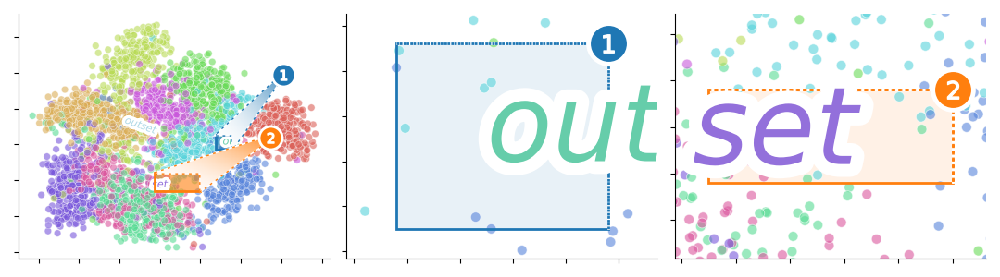

|PyPi| |CI| |Deploy Sphinx documentation to Pages| |GitHub stars|

Easily indicate zoom plot areas in Matplotlib

- Free software: MIT license
- Documentation: https://mmore500.com/outset
- Repository: https://github.com/mmore500/outset

Features
--------

Install
-------

``python3 -m pip install outset``

Gallery
-------

.. figure:: docs/assets/outset-gallery-collage.png
   :target: https://mmore500.com/outset/gallery.html
   :alt: outset gallery collage

Check out the project's `gallery page <https://mmore500.com/outset/gallery.html>`_ for example heatmap, imshow, kde lineplot, regplot, scatterplot, patch, and more visualizations created with ``outset``.

Basic Usage
-----------

Refer to the `quickstart guide <https://mmore500.com/outset/quickstart.html>`_ for more detailed usage information.

Select Outset Regions Manually
^^^^^^^^^^^^^^^^^^^^^^^^^^^^^^

.. code:: python

   from matplotlib import pyplot as plt
   import numpy as np
   import outset as otst
   import seaborn as sns

   grid1 = otst.OutsetGrid(
      [(-10, 8, -8, 12), (-5, 5, -1, 3)],  # frame positions (x0, y0, x1, y1
   )

   # broadcast plot content to all axes
   # adapted from https://matplotlib.org/stable/gallery/
   i, a, b, c, d = np.arange(0.0, 2*np.pi, 0.01), 1, 7, 3, 11
   grid1.broadcast(
      plt.plot,
      np.sin(i*a)*np.cos(i*b) * 20,  # x values
      np.sin(i*c)*np.cos(i*d) * 20,  # y values
      c="k",
      zorder=-1,
   )

   grid1.marqueeplot()  # render marquee annotations, adjust axlims

   plt.savefig("usage1.png")

Outset Data Subsets
^^^^^^^^^^^^^^^^^^^

.. code:: python

   grid2 = otst.OutsetGrid(  # setup axes grid
      aspect=0.6,
      data=sns.load_dataset("iris").dropna(),
      height=3,
      x="petal_width",
      y="petal_length",
      col="species",  # put each species in its own outset
      hue="species",   # make different color marquees
   )

   # map scatterplot over all axes
   grid2.map_dataframe(
      sns.scatterplot,
      x="petal_width",
      y="petal_length",
      legend=False,
      zorder=0,
   )

   grid2.marqueeplot()  # dispatch marquee render, adjust axlims
   grid2.add_legend()  # add figure-level legend

   plt.savefig("usage2.png")

Convert Outset Plots to Insets
^^^^^^^^^^^^^^^^^^^^^^^^^^^^^^

.. code-block:: python

   grid3 = otst.OutsetGrid(  # setup axes grid
      aspect=1.5,
      data=sns.load_dataset("iris").dropna(),
      height=4,
      x="petal_width",
      y="petal_length",
      col="species",  # put each species in its own outset
      hue="species",   # make different color marquees
   )

   # map scatterplot over all axes
   grid3.map_dataframe(
      sns.scatterplot,
      x="petal_width",
      y="petal_length",
      legend=False,
      zorder=0,
   )
   grid3.add_legend()  # add figure-level legend

   otst.inset_outsets(grid3, insets="NW")  # inset outset plots over source axes

   grid3.marqueeplot()  # dispatch marquee render, adjust axlims

   plt.savefig("usage3.png")

API Overview
------------

* |OutsetGrid|_: compose a source plot and zoom regions over it (e.g., "outsets") on a multiplot lattice

  * designate zoom regions directly, or as regions containing data subsets
  * object-oriented, "tidy data" interface a la ``seaborn.FacetGrid``

* |inset_outsets|_: rearrange an``OutsetGrid`` to place outset zoom regions as insets over the original source axes

* |marqueeplot|_: axis-level "tidy data" interface to draw marquees framing specified subsets of data

* |draw_marquee|_: low-level interface to draw individual marquee annotations

.. |OutsetGrid| replace:: ``outset.OutsetGrid``
.. _OutsetGrid: https://mmore500.com/outset/_autosummary/outset.OutsetGrid.html

.. |inset_outsets| replace:: ``outset.inset_outsets``
.. _inset_outsets: https://mmore500.com/outset/_autosummary/outset.inset_outsets.html

.. |marqueeplot| replace:: ``outset.marqueeplot``
.. _marqueeplot: https://mmore500.com/outset/_autosummary/outset.marqueeplot.html

.. |draw_marquee| replace:: ``outset.draw_marquee``
.. _draw_marquee: https://mmore500.com/outset/_autosummary/outset.draw_marquee.html

Read the full API documentation `here <https://mmore500.com/outset/_autosummary/outset.html#module-outset>`_.

Available Styling Extensions
^^^^^^^^^^^^^^^^^^^^^^^^^^^^

*Callout mark glyphs*: customize symbols identifying marquee annotations

* |MarkAlphabeticalBadges|_
* |MarkArrow|_
* |MarkInlaidAsterisk|_
* |MarkMagnifyingGlass|_
* |MarkRomanBadges|_

.. image:: docs/assets/callout-mark-glyphs.png
   :alt: comparison of available glyphs

.. |MarkAlphabeticalBadges| replace:: ``outset.mark.MarkAlphabeticalBadges``
.. _MarkAlphabeticalBadges: https://mmore500.com/outset/_autosummary/outset.mark.MarkAlphabeticalBadges.html

.. |MarkArrow| replace:: ``outset.mark.MarkArrow``
.. _MarkArrow: https://mmore500.com/outset/_autosummary/outset.mark.MarkArrow.html

.. |MarkInlaidAsterisk| replace:: ``outset.mark.MarkInlaidAsterisk``
.. _MarkInlaidAsterisk: https://mmore500.com/outset/_autosummary/outset.mark.MarkInlaidAsterisk.html

.. |MarkMagnifyingGlass| replace:: ``outset.mark.MarkMagnifyingGlass``
.. _MarkMagnifyingGlass: https://mmore500.com/outset/_autosummary/outset.mark.MarkMagnifyingGlass.html

.. |MarkRomanBadges| replace:: ``outset.mark.MarkRomanBadges``
.. _MarkRomanBadges: https://mmore500.com/outset/_autosummary/outset.mark.MarkRomanBadges.html

*Callout tweaks*: customize how marquee callouts are shaped and positioned

* |TweakReflect|_
* |TweakSpreadArea|_

.. |TweakReflect| replace:: ``outset.mark.TweakReflect``
.. _TweakReflect: https://mmore500.com/outset/_autosummary/outset.tweak.TweakReflect.html

.. |TweakSpreadArea| replace:: ``outset.mark.TweakSpreadArea``
.. _TweakSpreadArea: https://mmore500.com/outset/_autosummary/outset.tweak.TweakSpreadArea.html

Citation
--------

Contributing
------------

This project welcomes contributions and suggestions. Our documentation includes `detailed information to get you started <https://mmore500.com/outset/contributing.html#>`__.

.. |PyPi| image:: https://img.shields.io/pypi/v/outset.svg
   :target: https://pypi.python.org/pypi/outset
.. |CI| image:: https://github.com/mmore500/outset/actions/workflows/CI.yml/badge.svg
   :target: https://github.com/mmore500/outset/actions
.. |Deploy Sphinx documentation to Pages| image:: https://github.com/mmore500/outset/actions/workflows/sphinx.yml/badge.svg
   :target: https://github.com/mmore500/outset/actions/workflows/sphinx.yml
.. |GitHub stars| image:: https://img.shields.io/github/stars/mmore500/outset.svg?style=round-square&logo=github&label=Stars&logoColor=white
   :target: https://github.com/mmore500/outset
